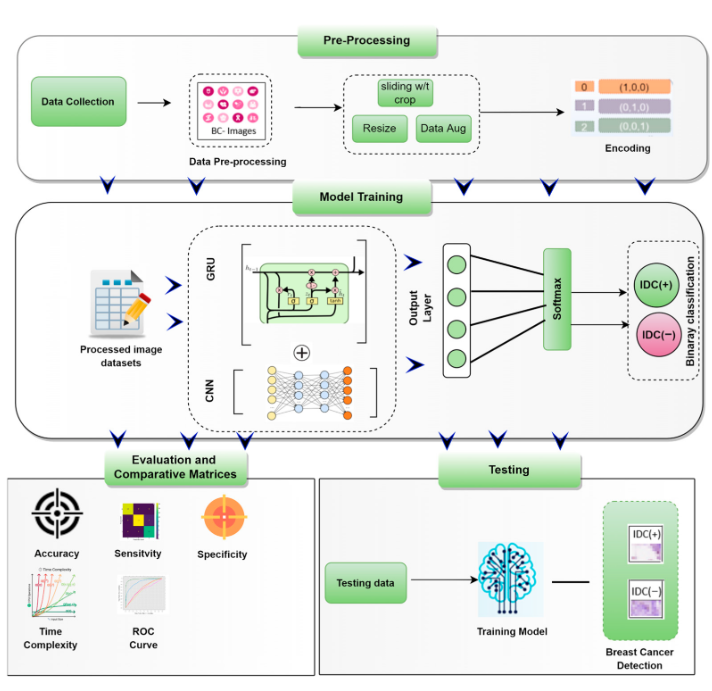
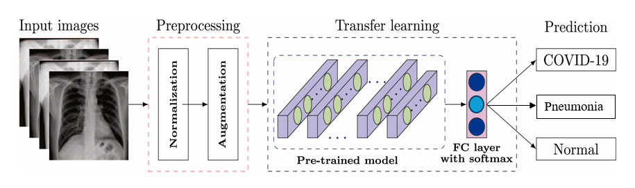

## **Summary:**
An interdisciplinary engineer with a solid foundation in engineering, artificial intelligence (AI), and data science, backed by a diverse academic background including the USA and UK. Experienced in engineering, research, AI-driven projects, financial modeling, mechanical design, and system development, coupled with finely tuned technical writing, critical thinking, and problem-solving skills. Proficient in AI/ML, deep learning, NLP, Gen AI, LLM, programming languages, MS Office, CAD, and mechanical engineering.

***

## **Education:**

- **Master’s Degree in Engineering, USA**
    

    
View Curriculum

    • Mathematical and Computational Modeling • Machine Learning • Deep Learning • Stochastic Modeling • Derivative Pricing • Econometrics • Portfolio Management • Organization and Project Management • Risk Management • Master’s Project Report
    

- **Master’s Degree in Artificial Intelligence (AI), UK**
    

    
View Curriculum

    • Mathematics and Statistics • Machine Learning  • Deep Learning   • Computer Vision  • Natural Language Processing (NLP)   • MLops • Reinforcement Learning • Generative AI • Master Thesis
    

- **Executive Postgraduate with Gen AI Specialization**
    

    
View Curriculum

    • Python Programming  • Statistics and Probability  • Data Visualisation and Analysis • Machine Learning  • Deep Learning  <!--• Computer Vision--> • Natural Language Processing (NLP)  • Generative AI  • Large Language Model (LLM) • Capstone Project
    

- **Bachelor’s Degree in Mechanical Engineering, Nepal**
    

    
View Curriculum

    • Engineering Mathematics • Statistics and Probability • Computer Programming • Control Systems • Numerical Method • Engineering Drawing and CAD  • Electrical and Electronics Engineering • Metrology • SOM • Instrumentation and Measurement • Applied Mechanics • Thermodynamics • Fluid Mechanics • Theory of Machines and Mechanisms • Machine Design • Heat and Mass Transfer • Manufacturing Engineering • Material Science • Internal Combustion Engines • Renewable Energy Systems • Automobile Engineering • Hydraulics and Pneumatics • Industrial Engineering • Engineering Physics • Engineering Chemistry • Engineering Economics • Kinematics of Machines • Refrigeration and Air Conditioning • Finite Element Method • Project Engineering and Management • Engineering Professional Ethics • Project Report    
    

***

## **Selective Skills:**

- **Research & Analysis:** Experience in reading, analyzing, and writing research papers, gathering information, and reviewing publications.
- **AI & Machine Learning:** Proficient in AI, machine learning, and deep learning algorithms, including regression analysis, classification, clustering, and neural networks.
- **NLP & Generative AI:** Knowledge and hands-on experience with NLP, generative AI, LLMs, RAG, OpenAI, ChatGPT API, DeepSeek, BERT, Gemini, Hugging Face, Transformers, LlamaIndex, and LangChain.
- **Data Science & Analytics:** Skilled in data preprocessing, feature engineering, exploratory data analysis (EDA), data visualization, hyperparameter tuning, optimization techniques, and model evaluation; solid foundation in mathematics and statistics.
- **Programming & Libraries:** Strong Python skills with experience using NumPy, Pandas, Matplotlib, Seaborn, TensorFlow, PyTorch, Scikit-learn, Keras, OpenCV, spaCy, NLTK, Hugging Face, and Transformers.
- **Cloud & Tools:** Experience with AWS, SQL, Git, GitHub, Jupyter Notebook, Kaggle, Google Colab, VS Code, and cloud computing; basic web development knowledge in HTML, CSS, and JavaScript.
- **Mechanical Engineering & CAD:** Proficient in mechanical engineering, design, and 2D/3D CAD using AutoCAD and SolidWorks.
- **Documentation & Project Skills:** Skilled in technical report writing, editing, document creation, and time management.
- **Soft Skills & Leadership:** Strong learning ability, independence, leadership, and critical thinking skills.
- **Office Tools:** Proficient in Microsoft Word, Excel, and PowerPoint.
  
***  

## **Languages skills:**

- English: Business Level Proficiency (TOEIC Certified)
- Japanese: Business Level Proficiency (JLPT-N2 Certified)
- Hindi: Intermediate Level Proficiency
- Nepali: Native or bilingual proficiency

***

## **Work Experience:**

- AI Engineer at Tokyo, Japan - (2020 to present)
- Mechanical Engineer at Tata Motors - (2018 to 2019)
- Internship Engineer at Pepsi-2017
  
***  

## **Licenses & Certifications:**

- Certificate for Registered Engineers - 2018
- Professional Mechanical Design, Solidworks, Certified by exam - 2023
- AI Qualification Certificate by the Japan Deep Learning Association (JDLA), Certified by exam, with 94% - 2025
- Generative AI Passport by Generative AI Utilization Promotion Association (GUGA), Japan, Certified by Exam with 92% - 2025
- Japan Ministry of Economy, Trade and Industry Observer - DX Promotion Passport1 (AI) by “Di-Lite” Japan, Certified by exam - 2025
- Generative AI Literacy Assessment Competition, GUGA, Japan, Top Ranked out of 2,221, Certified by Exam - 2025
- Generative AI Qualification Certificate by the Japan Deep Learning Association (JDLA), Certified by exam - 2025
  
*** 

## **Skill Development Courses:**

- The Deep Learning Specialization, DeepLearning.AI 
- Crash Course on Python, Google 
- Linear Algebra for Machine Learning and Data Science, DeepLearning.AI
- Neural Networks and Deep Learning, DeepLearning.AI
- Improving Deep Neural Networks: Hyperparameter Tuning, Regularization and Optimization, DeepLearning.AI
- Convolutional Neural Networks, DeepLearning.AI
- Sequence Models, DeepLearning.AI
- Introduction to Artificial Intelligence (AI), IBM
- Programming for Everybody (Getting Started with Python), University of Michigan 
- The Smithsonian Entrepreneur Incubator Course, US Embassy
- Engineering and Product Design Processes, Arizona State University
  
***

## **ML/AI Projects:**

### **Intelligent AI System for Breast Cancer Detection:**
Developed an intelligent deep learning–based system for automated breast cancer detection using whole slide histopathology images (WSIs) from the PCam Kaggle dataset. Implemented a hybrid CNN–GRU architecture to accurately detect and classify invasive ductal carcinoma (IDC) as positive or negative. The model combines convolutional layers for spatial feature extraction with GRU layers for sequential pattern learning, improving diagnostic reliability. Performance was evaluated using standard medical metrics including accuracy, precision, sensitivity, specificity, F1-score, and AUC, achieving strong predictive results and outperforming traditional CNN-LSTM, CNN-BiLSTM, and other ML/DL models. The system reduces manual diagnostic effort, minimizes misclassification risk, and supports early and accurate breast cancer detection.

***

    

***

### **AI-Based COVID-19 Detection System from Chest X-Ray Images:**
Developed an AI–based diagnostic system for automated COVID-19 detection using chest X-ray images, implemented with PyTorch. The system leverages a pretrained ResNet-18 convolutional neural network to classify X-ray images into three categories: Normal, Viral Pneumonia, and COVID-19. Advanced image preprocessing techniques-including resizing, normalization, and data augmentation were applied to enhance model generalization and robustness. The architecture utilizes residual learning for effective feature extraction, with a customized fully connected layer for multi-class classification. Model training employed Cross-Entropy loss and the Adam optimizer, with performance evaluated using accuracy and loss metrics. Visual analytics were integrated to display true versus predicted labels, enabling qualitative performance assessment. This AI-driven solution improves diagnostic efficiency, reduces manual interpretation errors, and supports medical professionals in rapid and reliable COVID-19 screening and clinical decision-making.

***

    

***

### **Gen AI Project: Generative Search System (Mr.HelpMate AI):**
Architecting a sophisticated Generative Search System named Mr.HelpMate AI, utilizing advanced Retrieval-Augmented Generation (RAG) techniques and state-of-the-art Hugging Face models. This project integrates cutting-edge frameworks such as LangChain and LlamaIndex to enhance the search experience through dynamic and contextually relevant responses. By combining powerful generative models with retrieval mechanisms, Mr.HelpMate AI aims to provide highly accurate and context-aware search results, enabling users to efficiently find and interact with information across diverse domains. This system leverages the latest advancements in AI to deliver intelligent and responsive search capabilities, transforming how users engage with digital content.

***

    

***

### **AI-Driven Cancer (Melanoma)-Detection System:**
Engineering a state-of-the-art multiclass classification model utilizing a bespoke Convolutional Neural Network (CNN) architecture within TensorFlow to enable automated detection and classification of skin cancer. This project employs advanced deep learning methodologies, including sophisticated feature extraction and hierarchical neural network layers, to discern and differentiate melanoma and other dermatological malignancies with high precision. By integrating cutting-edge image preprocessing techniques and model optimization strategies, the system aims to deliver a highly reliable diagnostic tool that supports dermatologists in early and accurate cancer detection, thereby significantly enhancing clinical decision-making and patient management through automated, real-time analysis.

***

    

***

### **AI-Driven Telecom Churn Prediction System:**
Designing a churn prediction model for the telecommunications industry using advanced machine learning techniques. This project focuses on developing and optimizing predictive models to accurately forecast customer attrition, leveraging a range of algorithms including Logistic Regression, Decision Trees, and Random Forests. By systematically evaluating model performance through rigorous metrics and aligning with business objectives, the system aims to identify key predictor variables that contribute to customer churn. The ultimate goal is to implement the most effective model, providing actionable insights to enhance customer retention strategies and drive business growth.

***

    

***

### **AI-Driven Gesture Recognition System:**
Developing a cutting-edge gesture recognition system for smart TVs, leveraging advanced deep learning techniques to enable intuitive, hands-free control. This project involves designing and implementing a robust deep learning model to accurately identify and classify five distinct user gestures from real-time video feeds. Utilizing sophisticated neural network architectures, including convolutional layers for feature extraction and recurrent layers for temporal pattern recognition, the system aims to translate user gestures into TV commands, eliminating the need for a remote control. This innovative approach enhances user experience by providing seamless and interactive control, advancing the usability and functionality of smart home devices.

***

    

***
### **AI-Driven Automatic Classification System Of Customer Complaints:**
Developing an intelligent classification system for automating the categorization of customer complaint tickets. This project leverages advanced machine learning techniques to build a solution that accurately identifies and classifies the type of complaint raised by customers from unstructured text data. By employing sophisticated natural language processing (NLP) methods and machine learning algorithms, the system aims to streamline complaint management processes, enhance operational efficiency, and improve response accuracy. The ultimate objective is to enable businesses to swiftly address customer issues and drive better customer satisfaction through automated, precise complaint categorization.

***

    

***

### **AI-Driven Stock Price Prediction System:**
Developed an AI-based stock price prediction system leveraging Long Short-Term Memory (LSTM) neural networks to model and forecast future stock prices based on historical time series data. The system was designed to capture long-term dependencies and trends in financial data using techniques such as data normalization, sliding window for sequence generation, and feature engineering including moving averages and technical indicators. LSTM layers were optimized with dropout regularization and Adam optimizer to prevent overfitting and improve convergence. The model was evaluated using metrics like Mean Squared Error (MSE).

***

    

***

### **AI-Driven Telecom Churn Prediction System:**
Designing a churn prediction model for the telecommunications industry using advanced machine learning techniques. This project focuses on developing and optimizing predictive models to accurately forecast customer attrition, leveraging a range of algorithms including Logistic Regression, Decision Trees, and Random Forests. By systematically evaluating model performance through rigorous metrics and aligning with business objectives, the system aims to identify key predictor variables that contribute to customer churn. The ultimate goal is to implement the most effective model, providing actionable insights to enhance customer retention strategies and drive business growth.

***

    

***

### **AI-Driven Bike Sharing Project:**
Developed a multiple linear regression model to forecast the demand for shared bikes using a dataset provided by BoomBikes, a leading bike-sharing service in the US. The project aimed to identify and analyze key factors influencing bike demand in various regions and weather conditions. The model was trained on historical data, incorporating variables such as temperature, humidity, wind speed, and seasonal effects to predict demand patterns. Feature engineering techniques, such as encoding categorical variables and scaling continuous variables, were used to improve model accuracy. Evaluated the model's performance using metrics like R-squared and Mean Absolute Error (MAE), achieving high predictive accuracy. The insights derived can help optimize resource allocation, improve customer satisfaction, and guide future business strategies.

***

    

***

### **AI-Driven House Price Prediction System:** 
Designed and implemented a predictive model for house prices using advanced regression techniques, including Ridge and Lasso regression. This system leverages historical housing market data, with features such as property size, location, number of rooms, and neighborhood demographics. Ridge regression was used to mitigate multicollinearity, while Lasso regression helped with feature selection by reducing the weight of less important variables to zero. The model was optimized using cross-validation techniques and evaluated through performance metrics like R-squared and Root Mean Squared Error (RMSE), providing accurate and interpretable predictions. The system offers valuable insights for real estate investors, homebuyers, and market analysts to make data-driven decisions.

***

    

***

### **AI-Driven Fake News Detection System:**
Developing a comprehensive Fake News Detection System employing a diverse array of machine learning models to combat misinformation. This project integrates several advanced classification algorithms, including Logistic Regression, Decision Tree Classification, Gradient Boosting Classifier, and Random Forest Classifier, to create a robust and reliable detection framework. By leveraging these diverse models, the system is designed to analyze textual data and identify misleading or false information with high accuracy. The approach incorporates feature engineering, model ensemble techniques, and rigorous evaluation metrics to ensure effective and scalable detection of fake news, contributing to a more informed and trustworthy information ecosystem.

***

    

***

### **AI-Driven Intelligent Symptom Checker:**
Developed an AI-driven system designed to analyze user-reported symptoms and provide potential diagnoses in real-time. Utilizing advanced NLP and ML models, the system identifies and classifies symptoms to suggest possible medical conditions, as well as recommend potential treatment options. This empowers users with reliable health information while also assisting doctors and researchers in identifying patterns, enhancing early symptom evaluation, and improving healthcare accessibility. The tool supports healthcare professionals by streamlining diagnosis and treatment decisions, ultimately contributing to more efficient patient care.

***

    

***

### **AI-Driven Handwriting Detection System:**
Developed an AI-powered handwriting detection system using a convolutional neural network (CNN) trained on a large dataset of handwritten images. The system efficiently classifies and recognizes digits and characters, utilizing advanced preprocessing techniques like normalization and data augmentation to enhance accuracy. With a well-optimized CNN architecture and regularization methods, the model achieved high precision, making it suitable for real-time applications.

***

    

***

### **AI-Driven Credit Card Fraud Detection System:**
Developed an AI-based credit card fraud detection system using machine learning algorithms to identify fraudulent transactions. The system was trained on a highly imbalanced dataset and utilized techniques such as oversampling and feature scaling to improve detection accuracy. Key models like Logistic Regression, Random Forest, and Gradient Boosting were implemented, with hyperparameter tuning and cross-validation to enhance performance. The final model achieved high precision and recall, providing real-time fraud detection capabilities.

***

    

***

### **AI-Eye for the Blind:**
Developed an AI-powered assistive technology, "Eye for the Blind," designed to help visually impaired individuals by recognizing and describing their surroundings in real-time. Leveraged deep learning techniques, including object detection models like YOLOv5, and natural language processing (NLP) for converting visual data into spoken descriptions. The system integrates a camera to capture images, processes them with the trained model, and provides auditory feedback via speech synthesis.

***

    

***

### **AI-Driven Heart Failure Prediction System:**
Developed a machine learning model to predict heart failure based on key clinical parameters, including anaemia, creatinine phosphokinase levels, diabetes, ejection fraction, blood pressure, platelets, serum creatinine, and serum sodium. This AI-driven system analyzes these indicators to predict heart failure risk, aiding in early diagnosis and improving treatment outcomes. Designed to assist doctors, researchers, and healthcare professionals in making more informed decisions, it is a cutting-edge solution at the intersection of AI and healthcare.

***

    

***

**Note:** All datasets used in these AI projects are sourced from verified and legal platforms, such as Kaggle, open-source repositories, and university databases, to ensure reliability and authenticity.

## **Mechanical Research Projects:**

### **Design and Development of Magnetic Bicycle:**
The conversion of magnetic power into mechanical energy is the prime subject of study for the researcher. The project on magnetic powered hybrid bicycle is focused on the investigation of the feasibility of the mechanical energy from the magnet which use its natural properties of attraction and repulsion of the magnet poles to create rotation of the shaft which can be harnessed to do a useful work.

### **Design:**
The strong Neodymium magnets (NdFeB40MGOe) arranged in proper inclination in flywheel and cover design and assembled in bicycle sprocket shaft produce magnetic force to assist the human effort. This investigation project was proposed by performing paper research, experiments, hardware prototype development and software simulation.

***

    

***

### **Procedure:**
The flywheel design was performed in Solidworks, magnetic simulation was performed in ANSYS software (FEMM). The repulsive force between magnets in outer circumference of flywheel and inner surface of the cover provides torque in sprocket shaft in addition to manual torque. The magnetic field, resultant force on magnetic flywheel was determined for rectangular magnets in circular position by magnetic simulation. The performance characteristic of the bicycle was determined by conducting practical experiment. The final design of the prototype was selected based on the optimum result obtained from the magnetic simulation in FEMM software. The alternative magnetic shielding material was used instead of Mu metal due to unavailability in local market. 

***

    

***

### **Conclusion:**
In conclusion, the implementation of the magnetic flywheel significantly enhanced the performance of the bicycle, demonstrating its potential to improve energy efficiency. This research underscores the promising future applications of this technology, suggesting that further studies are essential to fully explore its potential as a sustainable energy solution. The findings advocate for continued development of magnetic flywheel systems, which could ultimately serve as a viable contribution to green energy initiatives.

***

    

***
  
## **Contact:**

If you have any questions or want to collaborate, please don't hesitate to reach out. You can aslo connect with me through LinkedIn.

  <h2 style="text-align: center; margin-bottom: 20px;">Send Message</h2>
  <form action="https://formspree.io/f/xpzvvwpw" method="POST" style="margin-bottom: 0;">
    

      <input type="text" id="name" name="name" placeholder="Your Name" required style="width: 100%; padding: 15px; border: 1px solid #ccc; border-radius: 8px; font-size: 16px;">
    

    

      <input type="email" id="email" name="_replyto" placeholder="Your Email" required style="width: 100%; padding: 15px; border: 1px solid #ccc; border-radius: 8px; font-size: 16px;">
    

    

      <textarea id="message" name="message" rows="5" placeholder="Your Message" required style="width: 100%; padding: 15px; border: 1px solid #ccc; border-radius: 8px; font-size: 16px;"></textarea>
    

    <button type="submit" style="background-color: #4CAF50; color: white; padding: 15px 20px; border: none; border-radius: 8px; cursor: pointer; width: 100%; font-size: 16px;">Send Message</button>
  </form>

### --Thank you for visiting--
